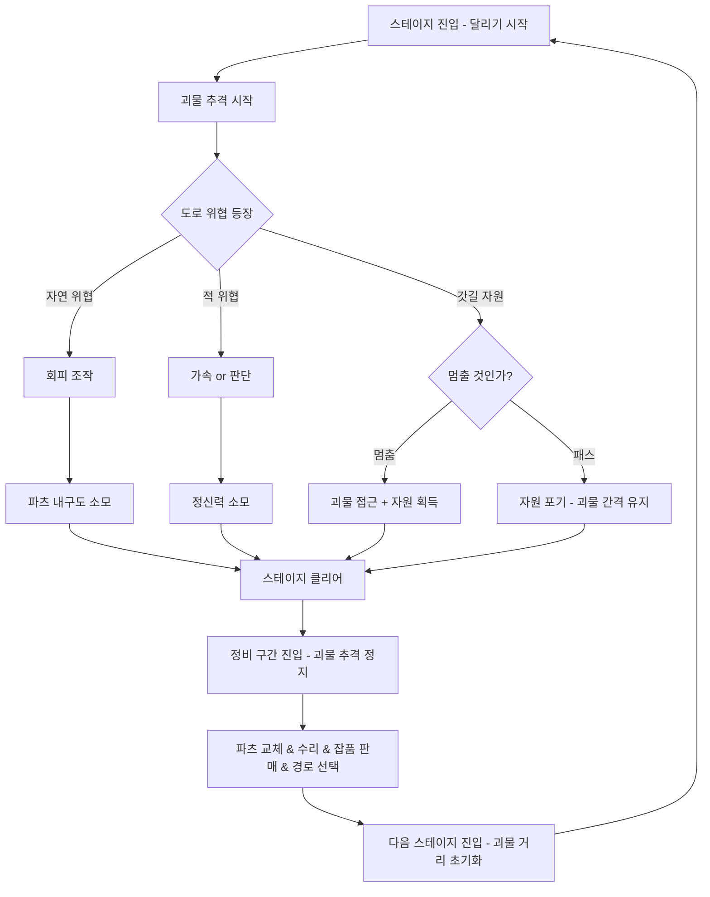

# 2. 속도 딜레마 시스템 & 코어 루프

## 속도 딜레마 시스템

LAST ROAD의 핵심 긴장 구조다. 플레이어는 매 순간 속도를 두 방향에서 동시에 저울질해야 한다.

### 속도를 올리면

| 효과 | 방향 |
|------|------|
| 괴물과의 간격 유지·확대 | ✅ 유리 |
| 장애물 회피 반응 시간 감소 | ❌ 불리 |
| 기름 소모율 증가 | ❌ 불리 |
| 갓길 정차 시 괴물 접근량 증가 | ❌ 불리 |

### 속도를 낮추면

| 효과 | 방향 |
|------|------|
| 장애물 여유롭게 회피 | ✅ 유리 |
| 갓길 자원 수색 가능 | ✅ 유리 |
| 괴물이 가까워짐 | ❌ 불리 |
| 컬트 AI 활성화 | ❌ 불리 |

### 파츠 시스템이 만드는 3번째 압박

타이어 파츠 상태가 속도 선택에 영향을 준다.

```
타이어 정상  →  감속 시간 빠름  →  빠른 속도에서도 장애물 회피 가능
타이어 손상  →  감속 시간 느림  →  빠른 속도가 오히려 위험해짐
```

좋은 파츠를 유지해야 빠른 속도 전략이 의미 있다. 파츠가 나쁠수록 속도를 낮춰야 하고, 속도를 낮추면 괴물이 가까워진다. **파츠 관리가 속도 선택의 전제조건**이 된다.

### 상황별 최적 속도 판단

플레이어가 스스로 계산해야 하는 구조. 정답 속도는 없다.

```
괴물 안전 + 장애물 많은 구간  →  중속 유지
괴물 임박 + 장애물 없는 직선  →  최고속
괴물 안전 + 갓길 자원 발견    →  감속 or 정차 판단
타이어 손상 + 괴물 임박        →  최악의 상황. 어느 쪽도 유리하지 않음
```

---

## 코어 루프



### 세션 루프 요약

1. **달린다** — Pseudo 3D 조작. 좌우 핸들 + 가속/감속. 뒤에서 괴물이 쫓아온다
2. **위협과 마주친다** — 자연 위협(파츠 손상) / 적(정신력·파츠 손상) / 갓길 자원(멈추면 괴물이 가까워짐)
3. **정비 구간에 도달한다** — 괴물 없음. 수리, 파츠 교체, 잡품 판매, 경로 선택
4. **다음 스테이지로 간다** — 괴물 거리 초기화. 스테이지가 깊어질수록 적 밀도·라디오 압박 증가
